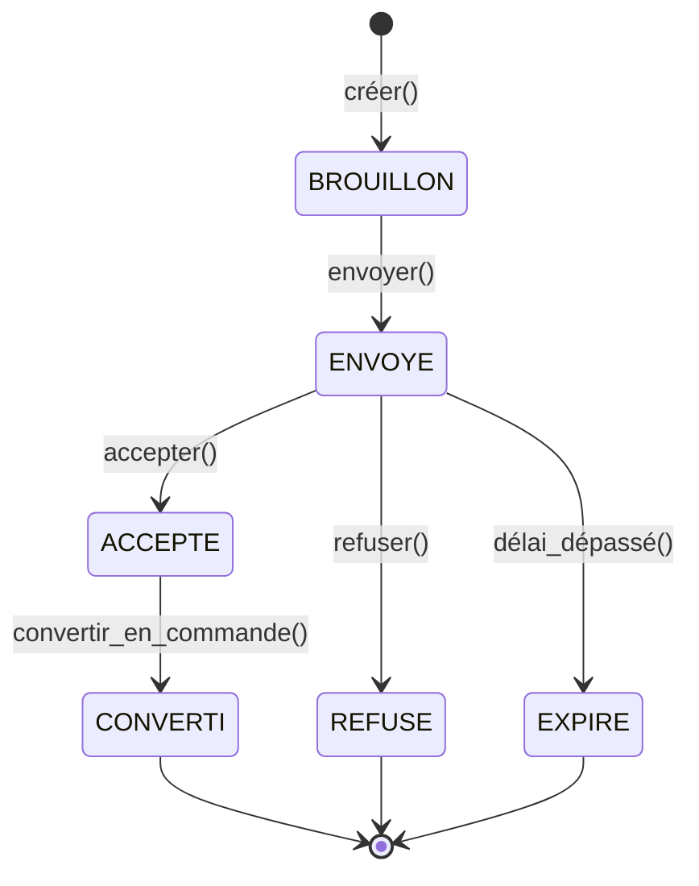
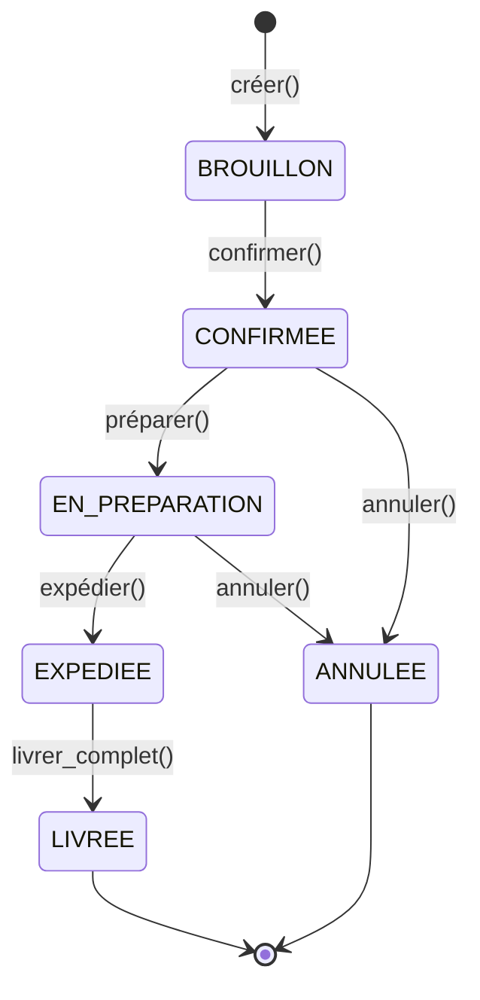
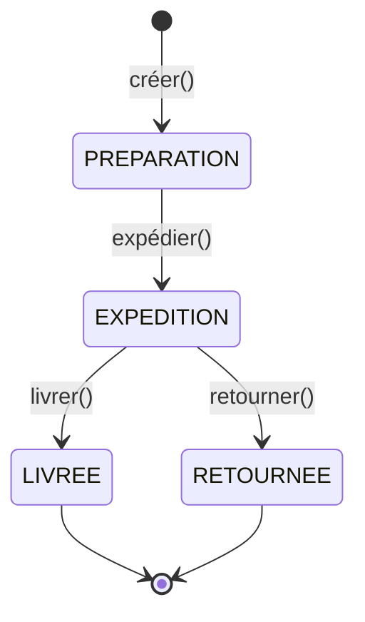
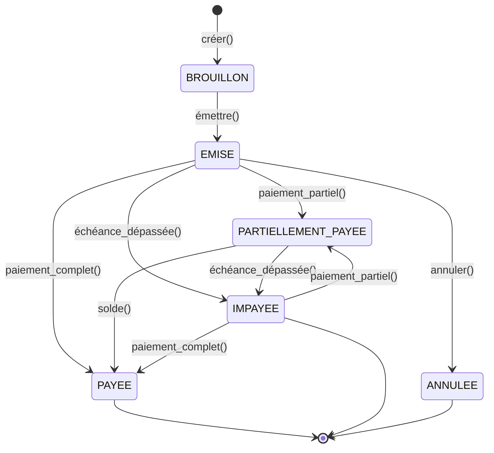
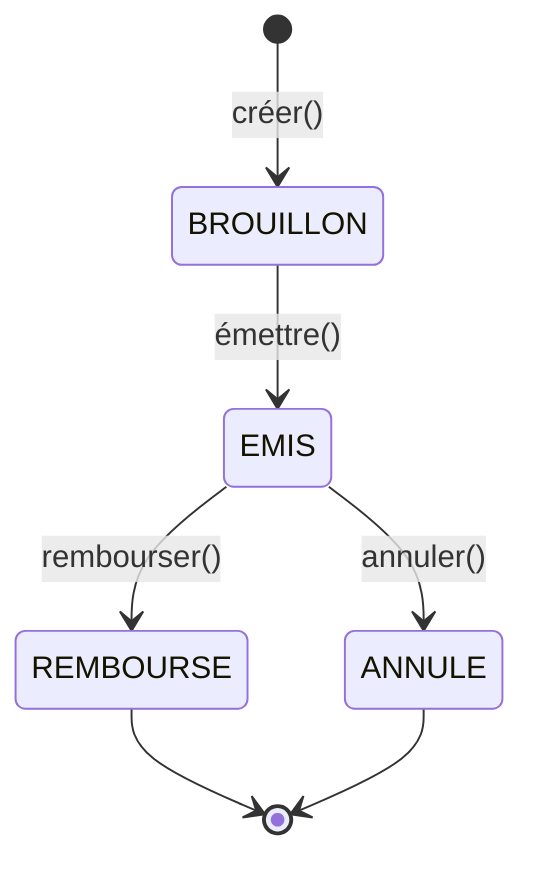
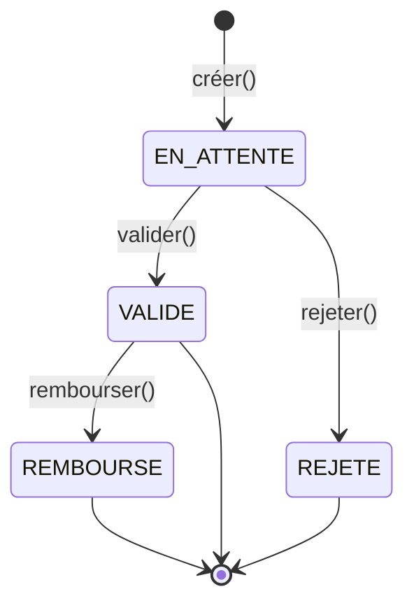
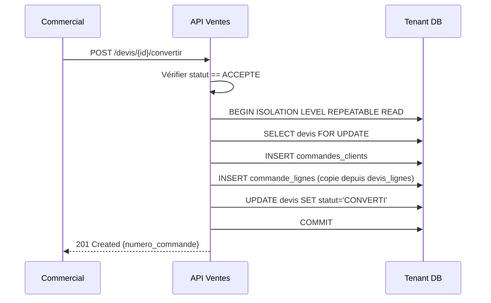
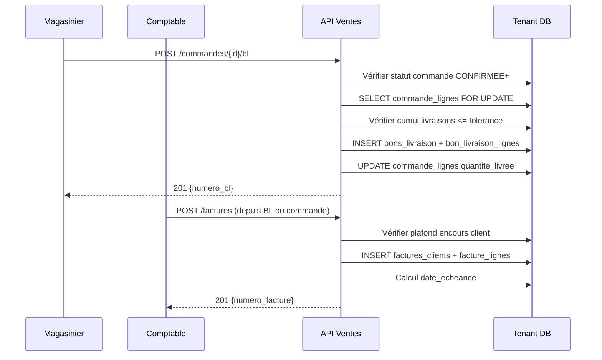
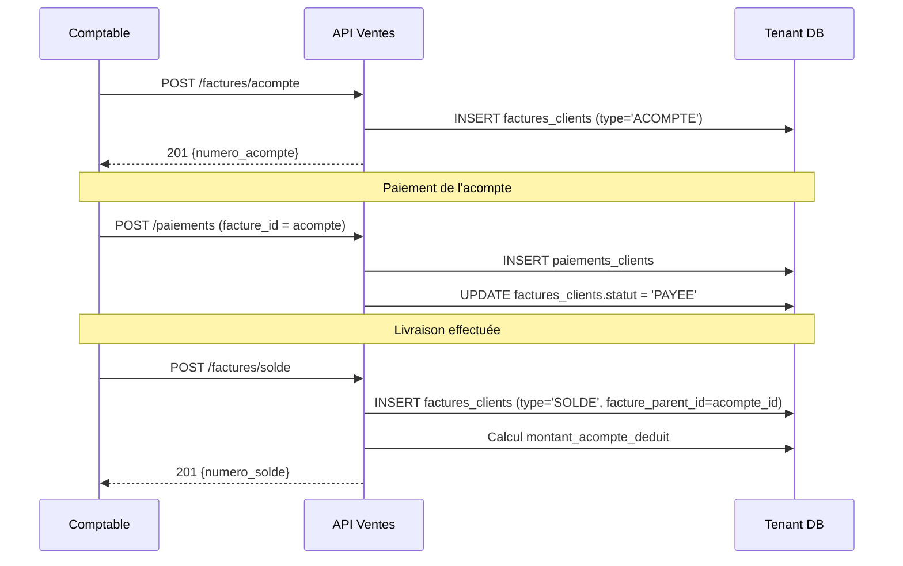
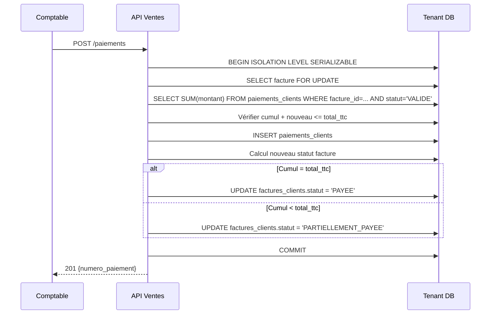

# Module Ventes — Diagrammes d'état et de séquence

**Projet** : yCogniCore Cloud
**Bloc** : 1.3 — Module Ventes (BL-102)
**Phase** : Complément à l'analyse métier
**Référence RG** : `01-analyse-metier.md` Section 5 (Source Unique de Vérité)

---

## Table des matières

1. Objet
2. Diagrammes d'état
3. Diagrammes de séquence
4. Récapitulatif
5. Historique des versions

---

## 1. Objet

Ce document complète l'analyse métier (`01-analyse-metier.md`) en fournissant :

- Les diagrammes d'état des 6 entités à cycle de vie documentaire
- Les diagrammes de séquence des 4 flux métier critiques

Il ne duplique aucune règle de gestion (principe SSOT). Chaque diagramme référence les identifiants RG-XX dont le texte complet se trouve dans `01-analyse-metier.md` Section 5.

---

## 2. Diagrammes d'état

### 2.1 Devis — ENUM `statut_devis`

Règles associées :

- RG-01 — Devis CONVERTI = immuable
- RG-02 — Conversion possible uniquement depuis ACCEPTE

Transitions autorisées :

- Création → BROUILLON (Commercial)
- BROUILLON → ENVOYE (Commercial) — envoi au client
- ENVOYE → ACCEPTE (Commercial) — acceptation client
- ENVOYE → REFUSE (Commercial) — refus client
- ENVOYE → EXPIRE (Système) — délai dépassé
- ACCEPTE → CONVERTI (Commercial) — conversion en commande

Transitions interdites :

- CONVERTI → * (état terminal)
- REFUSE → * (état terminal)
- EXPIRE → * (état terminal)
- BROUILLON → ACCEPTE (doit passer par ENVOYE)

---

### 2.2 Commande client — ENUM `statut_commande`

Règles associées :

- RG-03 — Commande CONFIRMEE ou au-delà ne peut plus changer de client
- RG-04 — Une commande peut générer plusieurs BL

Transitions autorisées :

- Création → BROUILLON (Commercial)
- BROUILLON → CONFIRMEE (Responsable Commercial) — confirmation
- CONFIRMEE → EN_PREPARATION (Magasinier) — préparation lancée
- EN_PREPARATION → EXPEDIEE (Magasinier) — expédition
- EXPEDIEE → LIVREE (Magasinier) — livraison complète
- CONFIRMEE → ANNULEE (Responsable Commercial) — annulation
- EN_PREPARATION → ANNULEE (Responsable Commercial) — annulation

Transitions interdites :

- LIVREE → * (état terminal)
- ANNULEE → * (état terminal)
- EXPEDIEE → ANNULEE (une fois expédiée, la commande ne peut plus être annulée — création d'un avoir requis)

---

### 2.3 Bon de livraison — ENUM `statut_livraison`

Règles associées :

- RG-05 — BL créable uniquement depuis commande CONFIRMEE ou au-delà
- RG-18 — Cumul livraisons inférieur ou égal à quantite × (1 + tolerance/100)

Transitions autorisées :

- Création → PREPARATION (Magasinier)
- PREPARATION → EXPEDITION (Magasinier) — expédition
- EXPEDITION → LIVREE (Magasinier) — livraison confirmée
- EXPEDITION → RETOURNEE (Magasinier) — retour

Transitions interdites :

- LIVREE → * (état terminal)
- RETOURNEE → * (état terminal)
- PREPARATION → LIVREE (doit passer par EXPEDITION)

---

### 2.4 Facture client — ENUM `statut_facture`

Règles associées :

- RG-06 — Facture émise depuis commande CONFIRMEE ou au-delà, ou depuis BL LIVREE
- RG-08 — Facture PAYEE ou ANNULEE = immuable
- RG-19 — Cumul paiements inférieur ou égal à total_ttc

Transitions autorisées :

- Création → BROUILLON (Comptable)
- BROUILLON → EMISE (Comptable) — émission
- EMISE → PARTIELLEMENT_PAYEE (Comptable) — paiement partiel enregistré
- EMISE → PAYEE (Comptable) — paiement complet
- EMISE → IMPAYEE (Système) — échéance dépassée
- EMISE → ANNULEE (Responsable Financier) — annulation
- PARTIELLEMENT_PAYEE → PAYEE (Comptable) — solde enregistré
- PARTIELLEMENT_PAYEE → IMPAYEE (Système) — échéance dépassée
- IMPAYEE → PARTIELLEMENT_PAYEE (Comptable) — paiement partiel après échéance
- IMPAYEE → PAYEE (Comptable) — paiement complet après échéance

Transitions interdites :

- PAYEE → * (état terminal)
- ANNULEE → * (état terminal)
- IMPAYEE → ANNULEE (une facture impayée ne peut pas être annulée directement — création d'un avoir requis)

Note importante : une facture IMPAYEE peut encore recevoir un paiement. L'état IMPAYEE est un constat (échéance dépassée), pas un état figé.

---

### 2.5 Avoir client — VARCHAR + CHECK

Règles associées :

- RG-07 — Avoir doit référencer une facture (facture_id NOT NULL)
- RG-09 — Avoir créable uniquement sur facture EMISE ou au-delà

Transitions autorisées :

- Création → BROUILLON (Comptable)
- BROUILLON → EMIS (Comptable) — émission
- EMIS → REMBOURSE (Comptable) — remboursement
- EMIS → ANNULE (Comptable) — annulation

Note : pas d'état PAYE — un avoir se rembourse.

---

### 2.6 Paiement client — ENUM `statut_paiement`

Règles associées :

- RG-19 — Cumul paiements inférieur ou égal à total_ttc
- RG-21 — Mode de paiement : ENUM mode_paiement
- RG-22 — Statut paiement : ENUM statut_paiement
- RG-23 — Paiement VALIDE = immuable

Transitions autorisées :

- Création → EN_ATTENTE (Comptable)
- EN_ATTENTE → VALIDE (Responsable Financier) — validation
- EN_ATTENTE → REJETE (Responsable Financier) — rejet
- VALIDE → REMBOURSE (Responsable Financier) — remboursement

Note : VALIDE n'est pas terminal — il peut encore passer à REMBOURSE.

---

## 3. Diagrammes de séquence

### 3.1 Flux « Devis → Commande »

Règles appliquées : RG-01, RG-02, RG-10, RG-11

Points d'attention :

- Transaction ACID en isolation REPEATABLE READ
- Verrouillage pessimiste sur devis (SELECT ... FOR UPDATE)
- Copie des lignes du devis vers la commande
- Passage devis en CONVERTI dans la même transaction

---

### 3.2 Flux « Commande → BL → Facture »

Règles appliquées : RG-04, RG-05, RG-06, RG-18, RG-40, RG-43, RG-44

Points d'attention :

- Vérification du statut de la commande
- Contrôle de la tolérance de sur-livraison
- Mise à jour incrémentale de quantite_livree
- Contrôle du plafond d'encours avant émission de facture
- Calcul automatique de l'échéance (date_emission + delai_paiement_jours)

---

### 3.3 Flux « Acompte → Solde »

Règles appliquées : RG-45, RG-19

Points d'attention :

- facture_parent_id obligatoire pour type_facture = 'SOLDE'
- montant_acompte_deduit trace la déduction
- Le solde réel à payer est égal à total_ttc moins montant_acompte_deduit

---

### 3.4 Flux « Paiement → Statut facture »

Règles appliquées : RG-19, RG-20, RG-22

Points d'attention :

- Isolation SERIALIZABLE
- Verrouillage pessimiste sur la facture
- Calcul du nouveau statut après insertion
- La mise à jour du statut est automatique

---

## 4. Récapitulatif

### 4.1 Diagrammes d'état

- Devis — 6 états, 6 transitions, états terminaux : CONVERTI, REFUSE, EXPIRE
- Commande client — 6 états, 7 transitions, états terminaux : LIVREE, ANNULEE
- Bon de livraison — 4 états, 4 transitions, états terminaux : LIVREE, RETOURNEE
- Facture client — 6 états, 10 transitions, états terminaux : PAYEE, IMPAYEE, ANNULEE
- Avoir client — 4 états, 4 transitions, états terminaux : REMBOURSE, ANNULE
- Paiement client — 4 états, 4 transitions, état stable : VALIDE ; états terminaux : REJETE, REMBOURSE
- Total — 30 états, 35 transitions

### 4.2 Diagrammes de séquence

- Devis vers Commande — Commercial, API, DB — isolation REPEATABLE READ
- Commande vers BL vers Facture — Magasinier, Comptable, API, DB — multi-transactions
- Acompte vers Solde — Comptable, API, DB — transactions simples
- Paiement vers Statut — Comptable, API, DB — isolation SERIALIZABLE

### 4.3 Couverture des RG

- RG-01 — Section 2.1 (Devis état)
- RG-02 — Sections 2.1 et 3.1
- RG-03 — Section 2.2 (Commande état)
- RG-04 — Sections 2.2 et 3.2
- RG-05 — Sections 2.3 et 3.2
- RG-06 — Sections 2.4 et 3.2
- RG-07 — Section 2.5 (Avoir état)
- RG-08 — Section 2.4 (Facture état)
- RG-09 — Section 2.5 (Avoir état)
- RG-10 à RG-12 — Sections 3.1, 3.2 et 3.3
- RG-13 à RG-17 — Section 2.4 (calculs)
- RG-18 — Section 3.2
- RG-19 — Sections 3.3 et 3.4
- RG-20 à RG-22 — Sections 2.6 et 3.4
- RG-23 — Section 2.6 (Paiement état)
- RG-40 — Section 3.2
- RG-43 et RG-44 — Section 3.2
- RG-45 — Section 3.3

---

## 5. Historique des versions

- Version 1.0.0 — 2026-10-08 — Création initiale
- Version 1.0.1 — 2026-10-09 — Ajout de 2 transitions sur IMPAYEE